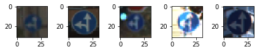
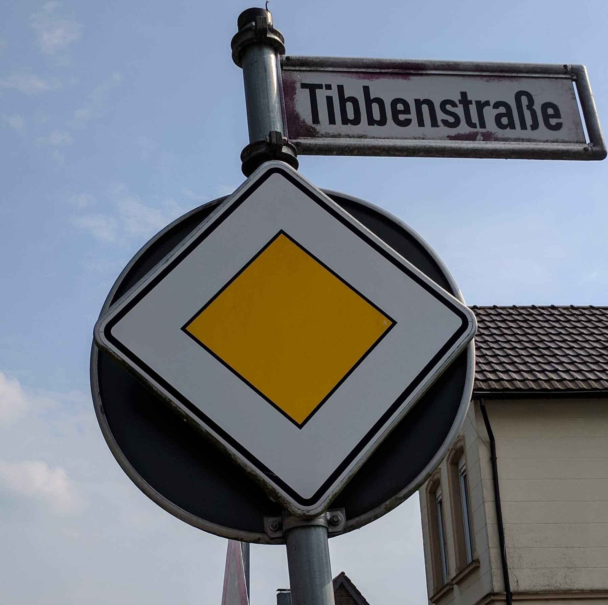

# **Self-Driving Car**
# **Project: Build a Traffic Sign Recognition Classifier**

## MK

Overview
---
In this project, use deep neural networks and convolutional neural networks to classify traffic signs. Train and validate a model so it can classify traffic sign images using the [German Traffic Sign Dataset](http://benchmark.ini.rub.de/?section=gtsrb&subsection=dataset). Use the trained model to predict and classify German traffic sign images from the web.

The Project
---
The goals/steps for this project:
* Load the German Traffic Sign data set
* Explore, summarize, and visualize the data set
* Design, train, and test a neural network model architecture
* Use neural network model to make predictions on new German Traffic Sign images from the web
* Analyze the softmax probabilities of the new images
* Summarize and reflect on your work in a written report

[//]: # (Image References)

[image1]: ./Writeup_IV/I1_DataSummary.png "I1_DataSummary"
[image2]: ./Writeup_IV/I2_DVE1.png "I2_DVE1"
[image3]: ./Writeup_IV/I3_SCTrain.png "I3_SCTrain"
[image4]: ./Writeup_IV/I3_SCValid.png "I3_SCValid"
[image5]: ./Writeup_IV/I3_SCTest.png "I3_SCTest"
[image6]: ./Writeup_IV/I4_CNNArch.png "I4_CNNArch"
[image7]: ./Writeup_IV/I5_CNNArch.png "I5_CNNArch"  

#

Project Python Code (Interactive python file: Traffic_Sign_Classifier_v7.ipynb)

Python Code/Implementation: [Link](./Traffic_Sign_Classifier_v7.ipynb)

#

#### Data Set Summary & Exploration

A basic summary of the data set. Data set analysis performed using python, numpy and/or pandas methods

* The size of training set is ?
* The size of the validation set is ?
* The size of test set is ?
* The shape of a traffic sign image is ?
* The number of unique classes/labels in the data set is ?

```python

### Replace each question mark with the appropriate value. 
### Use python, pandas or numpy methods rather than hard coding the results

# TODO: Number of training examples
n_train = np.shape(X_train)[0]

# TODO: Number of validation examples
n_valid = np.shape(X_valid)[0]

# TODO: Number of testing examples.
n_test = np.shape(X_test)[0]

# TODO: What's the shape of an traffic sign image?
image_shape = np.shape(X_train[0,:,:,:])

# TODO: How many unique classes/labels there are in the dataset.
n_classes = len(np.unique(y_train))

# training set
y_train_df = pd.DataFrame({'y_train':y_train})
y_train_agg = y_train_df['y_train'].value_counts().sort_index()
# train sample distribution
ts_dist = y_train_agg.values/(n_train/n_classes)*100

# validation set
y_valid_df = pd.DataFrame({'y_valid':y_valid})
y_valid_agg = y_valid_df['y_valid'].value_counts().sort_index()
# valid sample distribution
vs_dist = y_valid_agg.values/(n_valid/n_classes)*100

# test set
y_test_df = pd.DataFrame({'y_test':y_test})
y_test_agg = y_test_df['y_test'].value_counts().sort_index()
# test sample distribution
tes_dist = y_test_agg.values/(n_test/n_classes)*100

print("Number of training examples =", n_train)
print("Number of validation examples =", n_valid)
print("Number of testing examples =", n_test)
print("Image data shape =", image_shape)
print("Number of classes =", n_classes)
```

```python
Number of training examples = 34799
Number of validation examples = 4410
Number of testing examples = 12630
Image data shape = (32, 32, 3)
Number of classes = 43

```
[//]: # (![][image1])

#

An exploratory visualization of the data set was performed on the entire data set. Each traffic sign was dsiplayed and listed with the following set fo features:

* Traffic Sign id:
* Traffic Sign Label: 
* Traffic Sign 0 Training Sample Count : 
* Traffic Sign 0 Training Sample Distribution : 
* Display 5 sample image for each class/label from training set data

![][image2]

```

    Traffic Sign id: 0
    Traffic Sign Label: Speed limit (20km/h)
    Traffic Sign 0 Training Sample Count : 180
    Traffic Sign 0 Training Sample Distribution : 22.24%


    Traffic Sign id: 1
    Traffic Sign Label: Speed limit (30km/h)
    Traffic Sign 1 Training Sample Count : 1980
    Traffic Sign 1 Training Sample Distribution : 244.66%


    Traffic Sign id: 2
    Traffic Sign Label: Speed limit (50km/h)
    Traffic Sign 2 Training Sample Count : 2010
    Traffic Sign 2 Training Sample Distribution : 248.37%


    Traffic Sign id: 3
    Traffic Sign Label: Speed limit (60km/h)
    Traffic Sign 3 Training Sample Count : 1260
    Traffic Sign 3 Training Sample Distribution : 155.69%


    Traffic Sign id: 4
    Traffic Sign Label: Speed limit (70km/h)
    Traffic Sign 4 Training Sample Count : 1770
    Traffic Sign 4 Training Sample Distribution : 218.71%


    Traffic Sign id: 5
    Traffic Sign Label: Speed limit (80km/h)
    Traffic Sign 5 Training Sample Count : 1650
    Traffic Sign 5 Training Sample Distribution : 203.89%


    Traffic Sign id: 6
    Traffic Sign Label: End of speed limit (80km/h)
    Traffic Sign 6 Training Sample Count : 360
    Traffic Sign 6 Training Sample Distribution : 44.48%


    Traffic Sign id: 7
    Traffic Sign Label: Speed limit (100km/h)
    Traffic Sign 7 Training Sample Count : 1290
    Traffic Sign 7 Training Sample Distribution : 159.4%


    Traffic Sign id: 8
    Traffic Sign Label: Speed limit (120km/h)
    Traffic Sign 8 Training Sample Count : 1260
    Traffic Sign 8 Training Sample Distribution : 155.69%


    Traffic Sign id: 9
    Traffic Sign Label: No passing
    Traffic Sign 9 Training Sample Count : 1320
    Traffic Sign 9 Training Sample Distribution : 163.11%


    Traffic Sign id: 10
    Traffic Sign Label: No passing for vehicles over 3.5 metric tons
    Traffic Sign 10 Training Sample Count : 1800
    Traffic Sign 10 Training Sample Distribution : 222.42%


    Traffic Sign id: 11
    Traffic Sign Label: Right-of-way at the next intersection
    Traffic Sign 11 Training Sample Count : 1170
    Traffic Sign 11 Training Sample Distribution : 144.57%


    Traffic Sign id: 12
    Traffic Sign Label: Priority road
    Traffic Sign 12 Training Sample Count : 1890
    Traffic Sign 12 Training Sample Distribution : 233.54%


    Traffic Sign id: 13
    Traffic Sign Label: Yield
    Traffic Sign 13 Training Sample Count : 1920
    Traffic Sign 13 Training Sample Distribution : 237.25%


    Traffic Sign id: 14
    Traffic Sign Label: Stop
    Traffic Sign 14 Training Sample Count : 690
    Traffic Sign 14 Training Sample Distribution : 85.26%


    Traffic Sign id: 15
    Traffic Sign Label: No vehicles
    Traffic Sign 15 Training Sample Count : 540
    Traffic Sign 15 Training Sample Distribution : 66.73%


    Traffic Sign id: 16
    Traffic Sign Label: Vehicles over 3.5 metric tons prohibited
    Traffic Sign 16 Training Sample Count : 360
    Traffic Sign 16 Training Sample Distribution : 44.48%


    Traffic Sign id: 17
    Traffic Sign Label: No entry
    Traffic Sign 17 Training Sample Count : 990
    Traffic Sign 17 Training Sample Distribution : 122.33%


    Traffic Sign id: 18
    Traffic Sign Label: General caution
    Traffic Sign 18 Training Sample Count : 1080
    Traffic Sign 18 Training Sample Distribution : 133.45%


    Traffic Sign id: 19
    Traffic Sign Label: Dangerous curve to the left
    Traffic Sign 19 Training Sample Count : 180
    Traffic Sign 19 Training Sample Distribution : 22.24%


    Traffic Sign id: 20
    Traffic Sign Label: Dangerous curve to the right
    Traffic Sign 20 Training Sample Count : 300
    Traffic Sign 20 Training Sample Distribution : 37.07%


    Traffic Sign id: 21
    Traffic Sign Label: Double curve
    Traffic Sign 21 Training Sample Count : 270
    Traffic Sign 21 Training Sample Distribution : 33.36%


    Traffic Sign id: 22
    Traffic Sign Label: Bumpy road
    Traffic Sign 22 Training Sample Count : 330
    Traffic Sign 22 Training Sample Distribution : 40.78%


    Traffic Sign id: 23
    Traffic Sign Label: Slippery road
    Traffic Sign 23 Training Sample Count : 450
    Traffic Sign 23 Training Sample Distribution : 55.61%


    Traffic Sign id: 24
    Traffic Sign Label: Road narrows on the right
    Traffic Sign 24 Training Sample Count : 240
    Traffic Sign 24 Training Sample Distribution : 29.66%


    Traffic Sign id: 25
    Traffic Sign Label: Road work
    Traffic Sign 25 Training Sample Count : 1350
    Traffic Sign 25 Training Sample Distribution : 166.82%


    Traffic Sign id: 26
    Traffic Sign Label: Traffic signals
    Traffic Sign 26 Training Sample Count : 540
    Traffic Sign 26 Training Sample Distribution : 66.73%


    Traffic Sign id: 27
    Traffic Sign Label: Pedestrians
    Traffic Sign 27 Training Sample Count : 210
    Traffic Sign 27 Training Sample Distribution : 25.95%


    Traffic Sign id: 28
    Traffic Sign Label: Children crossing
    Traffic Sign 28 Training Sample Count : 480
    Traffic Sign 28 Training Sample Distribution : 59.31%


    Traffic Sign id: 29
    Traffic Sign Label: Bicycles crossing
    Traffic Sign 29 Training Sample Count : 240
    Traffic Sign 29 Training Sample Distribution : 29.66%


    Traffic Sign id: 30
    Traffic Sign Label: Beware of ice/snow
    Traffic Sign 30 Training Sample Count : 390
    Traffic Sign 30 Training Sample Distribution : 48.19%


    Traffic Sign id: 31
    Traffic Sign Label: Wild animals crossing
    Traffic Sign 31 Training Sample Count : 690
    Traffic Sign 31 Training Sample Distribution : 85.26%


    Traffic Sign id: 32
    Traffic Sign Label: End of all speed and passing limits
    Traffic Sign 32 Training Sample Count : 210
    Traffic Sign 32 Training Sample Distribution : 25.95%


    Traffic Sign id: 33
    Traffic Sign Label: Turn right ahead
    Traffic Sign 33 Training Sample Count : 599
    Traffic Sign 33 Training Sample Distribution : 74.02%


    Traffic Sign id: 34
    Traffic Sign Label: Turn left ahead
    Traffic Sign 34 Training Sample Count : 360
    Traffic Sign 34 Training Sample Distribution : 44.48%


    Traffic Sign id: 35
    Traffic Sign Label: Ahead only
    Traffic Sign 35 Training Sample Count : 1080
    Traffic Sign 35 Training Sample Distribution : 133.45%


    Traffic Sign id: 36
    Traffic Sign Label: Go straight or right
    Traffic Sign 36 Training Sample Count : 330
    Traffic Sign 36 Training Sample Distribution : 40.78%


    Traffic Sign id: 37
    Traffic Sign Label: Go straight or left
    Traffic Sign 37 Training Sample Count : 180
    Traffic Sign 37 Training Sample Distribution : 22.24%



    Traffic Sign id: 38
    Traffic Sign Label: Keep right
    Traffic Sign 38 Training Sample Count : 1860
    Traffic Sign 38 Training Sample Distribution : 229.83%


    Traffic Sign id: 39
    Traffic Sign Label: Keep left
    Traffic Sign 39 Training Sample Count : 270
    Traffic Sign 39 Training Sample Distribution : 33.36%


    Traffic Sign id: 40
    Traffic Sign Label: Roundabout mandatory
    Traffic Sign 40 Training Sample Count : 300
    Traffic Sign 40 Training Sample Distribution : 37.07%


    Traffic Sign id: 41
    Traffic Sign Label: End of no passing
    Traffic Sign 41 Training Sample Count : 210
    Traffic Sign 41 Training Sample Distribution : 25.95%


    Traffic Sign id: 42
    Traffic Sign Label: End of no passing by vehicles over 3.5 metric tons
    Traffic Sign 42 Training Sample Count : 210
    Traffic Sign 42 Training Sample Distribution : 25.95%


```
#

Below plots show sample count for each of the classes from the training, validation, and test sets

![][image3]
![][image4]
![][image5]


### Design and Test a Model Architecture

### 1. Preprocess Image Data
Several data and image preprocessing steps/techniques were perfoemd on the original German Traffic Sign data set. This will ease the neural net clasifier and the associated optimizer to reach the global minimum (loss function).

* Step 1: Shuffle training data to increase randomness in the data
* Step 2: Convert color image to grayscale. It was observed conversion of color image to grayscale for this specific data set will lower/minimze the data size by reducing number of channels in the image without the loss of any features.
* Step 3: Apply CLAHE (Contrast Limited Adaptive Histogram Equalization) algorithm to modify low contrast and brigthness images. This increases numer of acceptable samples for a given class
* Step 4: Scale the processed image data to lie between 0 and 1 by dividing all the pixel values by 255. Will help numeircal stability and convergence during optimizationn process
* Step 5: Center data around zero by using mean and variance. The mean and variance are calcualted through all the images per pixel from the same position. As in step 4, this will also help numeircal stability and convergence during optimizationn process. Step 5 was not implemented initially. This was a later addition to increase accuracy of the training process. Ideally, this step should have been implemented prior to the execution of neural-network

#### 2. Model Architecture 
* The neural-net model selected for this classification was based on convolutional neural-net (CNN) developed by  [Pierre Sermanet / Yann LeCun paper](http://yann.lecun.com/exdb/publis/pdf/sermanet-ijcnn-11.pdf)

![][image6]

The primary ascpect of this architecture, "In traditional ConvNets, the output of the last stage is fed to a classifier. In the present work the outputs of all the stages are fed to the classifier. This allows the classifier to use, not just high-level features, which tend to be global, invariant, but with little precise details, but also pooled lowlevel features, which tend to be more local, less invariant,
and more accurately encode local motifs."

This model was specifically selected, because of its application on German Traffic Sign Image Data Set.

Final model consisted of the following layer architecture:

![][image7]

#### 3. Model Training Parameters
The following training parameters were used during the training, validation, and testing process:
* Learning Rate = 0.001 (Reasoning: based on a few initial runs, 0.001 (default) seemed to be appropriate value for this study)
* Number of Steps (for optimizer): 4500-5000 (Reasoning: anything above 4500-5000 steps did not attain any further gains in performance)
* Batch Size: 125
* Dropout Probability: 0.5
* Optiization Technique: Adam Optimizer (Reasoning: succinctly adaptive learning rate algorithm)


#### 4. Solution Approach

Final model results were as follows:
* Validation set accuracy: 0.97
* Test set accuracy of: 0.957

Above numbers were arrived through an iterative process:
* Primary tuning parameter was the filter size on convolution layers. 
  * Initially ran the estimator using approximately 6 and 16 filters for convolution layers 1 and 2, this resulted in about 30-40% accuracy
  * Modified number of filters to 32 and 64 for convolution layers 1 and 2, this resulted in an increase of accuracy upto 80%
* Preprocess Image Data-Step 5 (averaging image data using mean and variance) resulted in a further increase of accuracy beyond 90%


### Test a Model on New Images

#### 1. Five German traffic signs found on the web:

[Label 8](https://www.bloomberg.com/opinion/articles/2019-01-27/autobahn-speed-limits-good-for-the-environment-bad-for-germany)


[Label 11](https://dc2ktown.files.wordpress.com/2013/08/blogpriroad.jpg)


[Label 12](https://angelikasgerman.co.uk/wp-content/uploads/2018/02/Priority.jpg)



[Label 13](https://angelikasgerman.co.uk/wp-content/uploads/2018/02/Vorfahrt-achten.jpg)


[Label 18](https://www.businessinsider.in/Minnesotas-governor-just-issued-a-sweeping-and-emotional-executive-order-about-vowels-on-street-signs/articleshow/46938741.cms)


Images with labels 11, 12, and 13 might potentially be difficult to classify, because of additional sign-boards sitting above the target traffic signs

#### 2. Model Predictions

* The model was able to correctly guess 4 of the 5 traffic signs, which gives an accuracy of 80%. 
* This compares reasonably to the accuracy on the test set of 95.7%.
* Model missed predicting label 11. Potential reasons
  * Original image is at an angle
  * Original image when modified to 32X32 pixels, the image got further skewed
  
  [NGTS_IP]: ./Writeup_IV/NGTS_IP.png "NGTS_IP"
  
  ![][NGTS_IP]
  

#### 3. Top 5 Softmax Probabilities for Each Image
* Original image label input: [8 11 12 13 18]
* Class prediction: [8 23 12 13 18]
* Softmax Probabilities
* Image 1 (Groundtruth Value: 8)
  * Predicted Label and Probability
  * Label 8: 0.73
    * Label 1: 0.12
    * Label 4: 0.12
    * Label 5: 0.028
    * Label 0: 0.0047
* Image 2 (Groundtruth Value: 11)  
  * Predicted Label and Probability
  * Label 23: 0.72
    * Label 12: 0.1
    * Label 11: 0.08
    * Label 40: 0.03
    * Label 27: 0.02
* Image 3 (Groundtruth Value: 12) 
  * Predicted Label and Probability
  * Label 12: 1
    * Label 40: 0
    * Label 9: 0
    * Label 14: 0
    * Label 37: 0
* Image 4 (Groundtruth Value: 13)
  * Predicted Label and Probability
  * Label 13: 1
    * Label 12: 0
    * Label 25: 0
    * Label 28: 0
    * Label 38: 0
* Image 5 (Groundtruth Value: 18)
  * Predicted Label and Probability
  * Label 18: 1
    * Label 26: 0
    * Label 37: 0
    * Label 1: 0
    * Label 22: 0 

[NGTS_T5Pa]: ./Writeup_IV/NGTS_T5Pa.png "NGTS_T5Pa"
![][NGTS_T5Pa]

[NGTS_T5Pb]: ./Writeup_IV/NGTS_T5Pb.png "NGTS_T5Pb"
![][NGTS_T5Pb]


### Reflections and Further Improvements
There are many improvements that can be implemented to further increase the predcition accuracy
* A significant variation in sample count between different classes can be minimized. Data augumentation can be perfromed using exisiting data set and performing operations such as rotation, mirroring, skewing etc. Tools are available within tensorflow itself that accomplishes this task with minimal effort
* There is a potential chance to improve accuracy by implementing L2-Regularization

